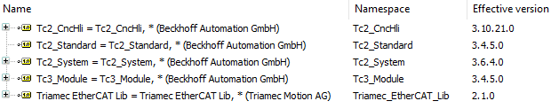

# TwinCAT Example using CNC and EtherCAT

This TwinCAT 3 application example helps you getting started to use a *Triamec* drive with *EtherCAT* fieldbus.

> [!NOTE]
> The example code makes use of the *Beckhoff* library *Tc2_CncHli*. Add it to the project.
> Example tested with TwinCAT *v3.1.4024.56* and following libraries:

## Prerequisites

The following prerequisites have to be met using this example code.

- A TwinCAT 3 runtime system (3.1.4024 or newer) with an EtherCAT-Master.
- *Triamec EtherCAT Lib* 2.1.0 or newer installed. Available as download from [triamec.com](https://www.triamec.com/en/ethercat.html).
- Drive commissioned. Checkout the *Servo Drive Setup Guide* from the [documents](https://www.triamec.com/en/documents.html) page.
- All drives must be powered and connected to the EtherCAT-Master.

