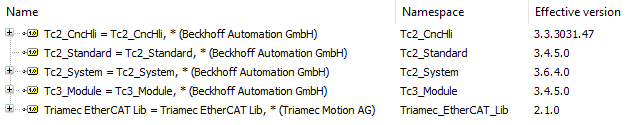

# TwinCAT Example using CNC and EtherCAT

This TwinCAT 3 application example helps you getting started to use a *Triamec* drive with *EtherCAT* fieldbus.

> [!NOTE]
> The example code makes use of the *Beckhoff* library *Tc2_CncHli*. Add it to the project.
> Example tested with TwinCAT *v3.1.4024.56* and following libraries:

## Prerequisites

The following prerequisites have to be met using this example code.

- A TwinCAT 3 runtime system (3.1.4024 or newer) with an EtherCAT-Master.
- *Triamec EtherCAT Lib* 2.1.0 or newer installed. Available as download from [triamec.com](https://www.triamec.com/en/ethercat.html).
- Drive commissioned. Checkout the *Servo Drive Setup Guide* from the [documents](https://www.triamec.com/en/documents.html) page.
- All drives must be powered and connected to the EtherCAT-Master.

## EtherCAT-Master Adapter
Open adapter settings for the EtherCAT-Master in **I/O > Devices > Device 1 (EtherCAT) > Adapter**.

Press **Search...** fo find the adapter on your system.

> [!NOTE]
> Make sure, that TwinCAT is in **Config Mode** before you search the *EtherCAT Master* Adapter.

## TwinCAT SYSTEM

Make sure to use an isolated core on the TwinCAT PC. As each PC is different, ensure to set up the **SYSTEM > Real-Time > Settings** accordingly. 

## Global Variable List (Triamec_GVL)

The following global variables have been defined to control and monitor the *Tria-Link* bus and axes.

| Variable              | Description                                |
| --------------------- | ------------------------------------------ |
| `gEnableAxes`         | variable to enable all axes                |
| `gStatusAxesEnabled`  | variable indicates that all axes enabled   |

## CNC Axis Function Block (CNC_Axis)

The function block extends *TE_AxisBase0* available in the *Triamec EtherCAT Lib* by the CNC specific interfaces.

## Test the Example

- **Save** and **Rebuild** the Solution.
- **Activate** the configuration and set TwinCAT to *Run Mode*.
- **Login** and **Start** the PLC.
- Open *Triamec_GVL* and enable the axes by setting **gEnableAxes** to **TRUE**, check **gStatusAxesEnabled** if all axes are enabled.

### Ready to move the axes

You should now be able to control the axes over CNC Channel GUI (Online GUI).
The control buttons are in the **MOTION > CNC > Axes > Channel_N > Online** dialog.

